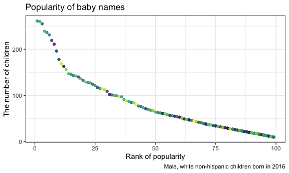

p8105\_hw2\_sc4636
================

# Data Wrangling 1

## *Problem 1*

  - Read and clean the Mr. Trash Wheel
sheet

<!-- end list -->

``` r
mr_trash = read_excel("./data/Trash-Wheel-Collection-Totals-8-6-19.xlsx",
                      range = "Mr. Trash Wheel!A2:N408") %>%
  janitor::clean_names() %>%
  rename(weight = weight_tons, volume = volume_cubic_yards) %>% 
  drop_na(dumpster) %>%
  mutate(sports_balls = as.integer(round(sports_balls)))
```

  - Read and clean precipitation data for 2017 and
2018

<!-- end list -->

``` r
prcp_2017 = read_excel("./data/Trash-Wheel-Collection-Totals-8-6-19.xlsx",
                       range = "2017 Precipitation!A2:B14") %>%
  janitor::clean_names() %>% 
  drop_na(total) %>% 
  mutate(year = 2017)

prcp_2018 = read_excel("./data/Trash-Wheel-Collection-Totals-8-6-19.xlsx",
                       range = "2018 Precipitation!A2:B14") %>%
  janitor::clean_names() %>% 
  drop_na(total) %>% 
  mutate(year = 2018)
```

  - Combine the precipitation datasets

<!-- end list -->

``` r
prcp_1817 = bind_rows(prcp_2017, prcp_2018) %>% 
  mutate(month = month.name[month]) %>% 
  arrange(month, year, total)
```

The tidied Mr. Trash Wheel dataset has 344 observations of 14 variables,
and includes information on the dumpster number, date of collection,
amount of total litter and litter type, with key variables such as
*dumpster, month, year, date, weight, volume*.

The combined dataset for precipitation in 2017 and 2018 has 24
observations of 3 variables including *month, total, year*. The total
precipitation in 2018 was 70.33. The median number of sports balls in a
dumpster in 2017 was 8.

## *Problem 2*

  - Clean the data in pols-month.csv

<!-- end list -->

``` r
pols = read_csv("./data/pols-month.csv") %>% 
  janitor::clean_names() %>% 
  separate(mon, c("year", "month", "day"), "-") %>% 
  mutate_if(is.character, as.numeric) %>% 
  mutate(month = month.abb[month]) %>% 
  mutate(president = if_else(prez_dem == 1, "dem", "gop")) %>% 
  select(-prez_gop, -prez_dem, -day)
```

  - Clean the data in snp.csv

<!-- end list -->

``` r
snp = read_csv("./data/snp.csv") %>% 
  janitor::clean_names() %>% 
  separate(date, c("month", "day", "year"), "/") %>% 
  mutate_if(is.character, as.numeric) %>% 
  mutate(month = month.abb[month]) %>% 
  select(year, month, -day, close)
```

  - Clean the data in unemployment

<!-- end list -->

``` r
unemploy = read_csv("./data/unemployment.csv") %>% 
  pivot_longer(Jan:Dec, names_to = "month", values_to = "unemploy_pct") %>% 
  janitor::clean_names()
```

  - Join the datasets

<!-- end list -->

``` r
pols_snp = left_join(pols, snp, by = c("year", "month"))

pols_snp_unemploy = left_join(pols_snp, unemploy, by = c("year", "month"))
```

The dataset `pols` contains 822 observations of 9 variables and includes
information on the number of politicians at any given time with key
variables *year, month, president*. The year range for this dataset is
1947, 2015.

The dataset `snp` contains 787 observations of 3 variables with
information of the closing values on given dates. It has variables
*year, month, close*. The year range for this dataset is 1950, 2015.

The dataset `unemployment` contains 816 observations of 3 variables
indicating percentage of unemployment at different time with variables
*year, month, unemploy\_pct*. The year range for this dataset is 1948,
2015.

The joined dataset contains 822 observations of 11 variables. It has key
variables *year, month, president, close, unemploy\_pct*. The year range
for this dataset is 1947, 2015, the same as the dataset `pols`.

## *Problem 3*

  - Load and tidy the data

<!-- end list -->

``` r
baby_name = read_csv("./data/Popular_Baby_Names.csv") %>%
  janitor::clean_names() %>% 
  mutate_if(is.character, str_to_title) %>% 
  mutate(ethnicity = recode(ethnicity,
                            "Asian And Paci" = "Asian And Pacific Islander",
                            "Black Non Hisp" = "Black Non Hispanic",
                            "White Non Hisp" = "White Non Hispanic")) %>% 
  distinct()
```

  - Tables

<!-- end list -->

``` r
olivia_pop = baby_name %>% 
  filter(childs_first_name == "Olivia") %>% 
  select(ethnicity, year_of_birth, rank) %>%
  pivot_wider(names_from = "year_of_birth", values_from = "rank")
```

| Ethnicity                  | 2016 | 2015 | 2014 | 2013 | 2012 | 2011 |
| :------------------------- | ---: | ---: | ---: | ---: | ---: | ---: |
| Asian And Pacific Islander |    1 |    1 |    1 |    3 |    3 |    4 |
| Black Non Hispanic         |    8 |    4 |    8 |    6 |    8 |   10 |
| Hispanic                   |   13 |   16 |   16 |   22 |   22 |   18 |
| White Non Hispanic         |    1 |    1 |    1 |    1 |    4 |    2 |

Table 1: Popularity of ‘Olivia’

``` r
male_pop = baby_name %>% 
  filter(gender == "Male", rank == "1") %>% 
  select(ethnicity, year_of_birth, childs_first_name) %>% 
  pivot_wider(names_from = "year_of_birth", values_from = "childs_first_name")
```

| Ethnicity                  | 2016   | 2015   | 2014   | 2013   | 2012   | 2011    |
| :------------------------- | :----- | :----- | :----- | :----- | :----- | :------ |
| Asian And Pacific Islander | Ethan  | Jayden | Jayden | Jayden | Ryan   | Ethan   |
| Black Non Hispanic         | Noah   | Noah   | Ethan  | Ethan  | Jayden | Jayden  |
| Hispanic                   | Liam   | Liam   | Liam   | Jayden | Jayden | Jayden  |
| White Non Hispanic         | Joseph | David  | Joseph | David  | Joseph | Michael |

Table 2: The most popular name for male children

  - Scatter
plot


